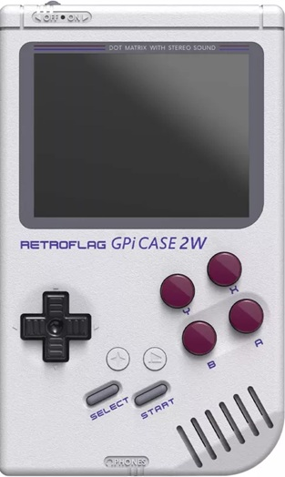

# PINN_display_patch_GPI_CASE_2W

a quick edit of config.txt and Microsoft_X-Box_360_pad_8A_11B.json in order to boot PINN on rpi zero2w with a retroflag gpi case 2w with wifi and control/gamepad support

that one ->> 

take your microSD card and flash PINN from rpi-amager
take it off your computer and re-insert it (or just remount it)
go to damn boot partition (the one with config.txt in it)
copy over config.txt and Microsoft_X-Box_360_pad_8A_11B.json to the root of your microSD card boot partition.
edit wpa_supplicant to add your wifi setting and copy it to the root of your microSD card boot partition.

<h1>Controls aka Microsoft_X-Box_360_pad_8A_11B.json</h1>
 
-select is on the keyboard shift (mash it to get to PINN manager page )

 
-dpad is mouse movment 

 
-a is left click

 
-b is right click

 
-start is enter

 
-x is escape (that lead to a choice of os to boot)

 
 
 For more informations or custom Controls just read and/or edit Microsoft_X-Box_360_pad_8A_11B.json

<h1>HELP NEEDED</h1>
for now i was unable to boot any of a proper linux desktop on this thing
i want to be able to navigate raspbian with a virtual keyboard on GPI CASE 2w only with button
I am looking for a way to boot a proper linux Desktop environment on this thing, please contact me

additional thought
- Microsoft_X-Box_360_pad_8A_11B.json config might be improved

